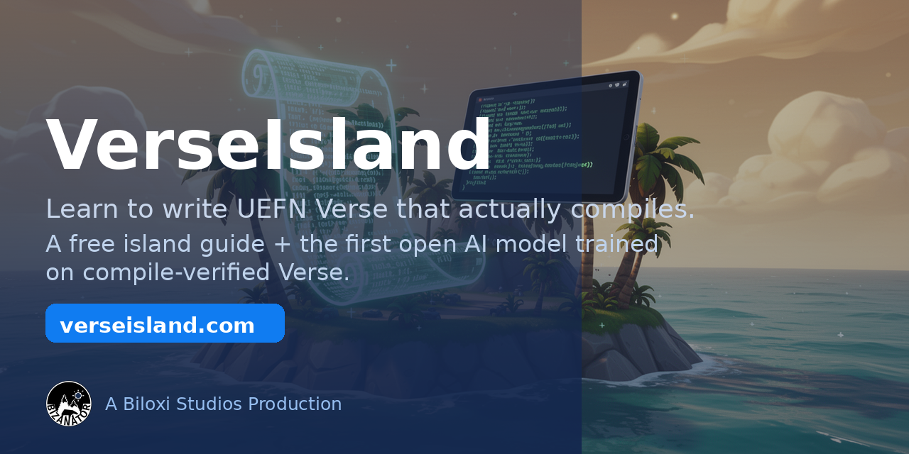

# VerseIsland

Public code, tutorials, and agent tooling for **learning UEFN Verse** — Unreal Editor for Fortnite's programming language — from the island. 🌴

---

## 🌴 About Verse Island

Verse Island is a free, island-themed site for learning to write **UEFN Verse** — every
lesson, reference page, and code snippet is verified on the real UEFN compiler before it
ships. This repo holds the public code, tutorials, and agent tooling that go with it.
Explore it all at **[VerseIsland.com](https://verseisland.com)**.

---

## Verse Authoring Rules (for coding agents)

A drop-in ruleset that makes LLM/agent-written **UEFN Verse** actually compile —
derived from 1,418 real UEFN compiles (the top 3 of 8 rules cover ~73% of failures),
every example verified on the live UEFN compiler.

- **Skill file:** [`skills/verse-authoring/SKILL.md`](skills/verse-authoring/SKILL.md) — paste into your agent's system prompt / `AGENTS.md`.
- **Full human guide:** https://verseisland.com/guides/writing-verse-that-compiles
- **Verse-Coder model (free, runs on one GPU):** https://huggingface.co/BizaNator/Verse-Coder-30B-v1

*The skill file is licensed CC BY 4.0 — attribute Verse Island (verseisland.com).*

---

## 🌴 Verse Island

**Learn to write UEFN Verse that actually compiles**

Created by **BizaNator**

[VerseIsland.com](https://verseisland.com) | [BrainDeadGuild.com](https://BrainDeadGuild.com) | [BrainDead.TV](https://BrainDead.TV) | [Discord](https://braindeadguild.com/discord)

*Building tools and tutorials for the BrainDeadGuild community*

---

**A Biloxi Studios Inc. Production**

© 2026 Biloxi Studios Inc. — All Rights Reserved

## Support

- GitHub Issues: [Report bugs](https://github.com/BizaNator/VerseIsland/issues)
- Discord: [BrainDeadGuild](https://BrainDeadGuild.com/discord)
